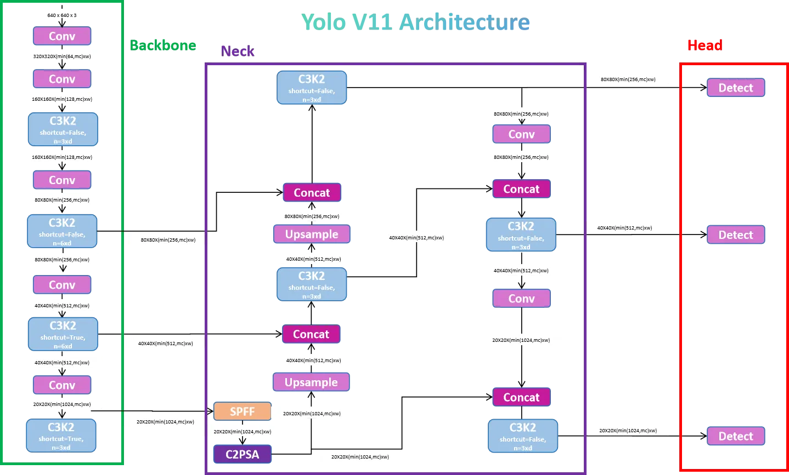

# 🐟 YOLOv11 Instance Segmentation — Atlantic Salmon Spot Analysis

A custom YOLOv11-based instance segmentation pipeline for detecting and analyzing pigmentation spots on Atlantic salmon (*Salmo salar*). Built for production-grade training, validation, and inference with integrated grayscale signature extraction for downstream statistical analysis.

---

## ✨ Key Features

- **YOLOv11x-seg architecture** — 62M parameters with C3k2, C2PSA, and SPPF blocks
- **Instance segmentation** — Pixel-precise spot masks via 32-coefficient Proto head
- **Grayscale signature analysis** — Vectorized intensity binning for quantitative spot characterization
- **Mixed precision training** — Automatic FP16/BF16 via PyTorch AMP (~2× faster, ~50% less VRAM)
- **Multi-GPU support** — DistributedDataParallel (DDP) with SyncBatchNorm
- **Dual-model ensemble** — `predict_cmb.py` fuses predictions from two models via cross-model NMS
- **Checkpoint resume** — Full state restoration (epoch, optimizer, EMA, scheduler)
- **Stress experiment pipeline** — Automated export of per-fish, per-day, per-side spot statistics

---

## 📁 Project Structure

```
YOLO/
├── train.py              # Training loop (AMP, DDP, EMA, loss scaling, resume)
├── val.py                # Validation with mAP@0.5:0.95 for boxes & masks
├── predict.py            # Single-model inference with spot analysis
├── predict_cmb.py        # Dual-model ensemble inference
│
├── yolo.py               # SegmentationModel definition & YAML parser
├── common_layers.py      # Network building blocks (Conv, C3k2, C2PSA, SPPF, Proto, etc.)
├── loss.py               # Task-aligned assigner + v8DetectionLoss + v8SegmentationLoss
├── dmb.py                # AutoBackend — unified model loading & inference
├── dataloader.py         # Training dataloader (mosaic, MixUp, masks) + inference LoadImages
├── helpers.py            # NMS, mask processing, metrics, plotting, box/mask utilities
├── utils.py              # Device selection, EMA, profiling, image checks, model loading
├── logger.py             # Logging configuration
├── callbacks.py          # Training event callbacks
│
├── model/
│   └── yolo11x-seg.yaml  # Architecture config (backbone + head + Segment)
├── data/
│   └── hyps/
│       └── hyp.scratch-high.yaml  # Training hyperparameters
├── data1/
│   └── data.yaml         # Dataset config (train/val/test paths, class names)
├── pretrained/            # Pretrained weights (.pt)
├── train-seg/             # Training outputs (weights, plots, results.csv)
├── runs/                  # Inference & validation outputs
└── samples/               # Sample images for quick testing
```

---

## 🚀 Getting Started

### Prerequisites

```bash
# Python 3.8+
pip install torch torchvision numpy opencv-python pyyaml tqdm matplotlib pandas pillow seaborn
```

### Dataset Setup

Prepare your dataset in YOLO segmentation format:

```
data1/
├── data.yaml          # nc, names, train/val/test paths
├── train/
│   ├── images/        # .jpg, .png, etc.
│   └── labels/        # YOLO segmentation .txt (class x1 y1 x2 y2 ... xn yn)
├── valid/
│   ├── images/
│   └── labels/
└── test/
    ├── images/
    └── labels/
```

**`data.yaml` example:**
```yaml
train: data1/train/images
val: data1/valid/images
test: data1/test/images
nc: 1
names: ['spot']
```

---

## 🏋️ Training

### Basic Training

```bash
python train.py \
  --weights pretrained/yolo11x-seg.pt \
  --cfg model/yolo11x-seg.yaml \
  --data data1/data.yaml \
  --epochs 300 \
  --batch-size 4 \
  --imgsz 640 \
  --device 0
```

### Advanced Options

```bash
python train.py \
  --weights pretrained/yolo11x-seg.pt \
  --cfg model/yolo11x-seg.yaml \
  --data data1/data.yaml \
  --epochs 300 \
  --batch-size 8 \
  --imgsz 640 \
  --optimizer AdamW \
  --cos-lr \
  --multi-scale \
  --save-period 25 \
  --patience 50 \
  --device 0
```

### Multi-GPU (DDP)

```bash
torchrun --nproc_per_node 4 train.py \
  --weights pretrained/yolo11x-seg.pt \
  --cfg model/yolo11x-seg.yaml \
  --data data1/data.yaml \
  --epochs 300 \
  --batch-size 16 \
  --sync-bn \
  --device 0,1,2,3
```

### Resume Training

```bash
python train.py --resume
```

### Key Training Arguments

| Argument | Default | Description |
|:--|:--|:--|
| `--weights` | `pretrained/yolo11x-seg.pt` | Pretrained weights or checkpoint |
| `--cfg` | `model/yolo11x-seg.yaml` | Model architecture YAML |
| `--data` | `data1/data.yaml` | Dataset configuration |
| `--epochs` | `300` | Total training epochs |
| `--batch-size` | `4` | Batch size (all GPUs combined) |
| `--imgsz` | `640` | Training image size (pixels) |
| `--optimizer` | `AdamW` | Optimizer (`SGD`, `Adam`, `AdamW`) |
| `--cos-lr` | `false` | Use cosine annealing LR schedule |
| `--multi-scale` | `false` | Random image size ±50% each batch |
| `--mask-ratio` | `4` | Mask downsampling ratio (saves memory) |
| `--no-overlap` | `false` | Non-overlapping masks (faster, slightly lower mAP) |
| `--resume` | `false` | Resume from latest checkpoint |
| `--patience` | `100` | Early stopping patience (epochs) |

---

## 📊 Validation

```bash
python val.py \
  --weights train-seg/weights/best.pt \
  --data data1/data.yaml \
  --batch_size 4 \
  --imgsz 640 \
  --device 0
```

Outputs include:
- Box and mask mAP@0.5 and mAP@0.5:0.95 per class
- Precision-Recall, F1, and Confusion Matrix plots
- Speed benchmarks (pre-process, inference, NMS)

---

## 🔍 Inference

### Single-Model Prediction

```bash
python predict.py \
  --weights train-seg/weights/best_spots.pt \
  --source test/images \
  --imgsz 640 \
  --conf-thres 0.25 \
  --save-txt \
  --save-conf \
  --device 0
```

### Dual-Model Ensemble

```bash
python predict_cmb.py \
  --weights1 train-seg/weights/best_yolov11_spots.pt \
  --weights2 train-seg/weights/best_yolov8_modified_spots.pt \
  --source test/images \
  --save-txt \
  --save-conf
```

### Stress Experiment Pipeline

For biological stress analysis with per-fish grayscale statistics:

```bash
python predict.py \
  --weights train-seg/weights/best_spots.pt \
  --source samples \
  --save-txt \
  --save-conf \
  --save-stress-exp-data \
  --save-stress-exp-plots
```

This generates:
- **`Stat data/data.csv`** — Per-spot grayscale mean intensity and pixel count
- **`Stat plots/`** — Line, swarm, box, scatter, and violin plots per fish

---

## ⚙️ Hyperparameters

Configured in [`data/hyps/hyp.scratch-high.yaml`](data/hyps/hyp.scratch-high.yaml):

| Parameter | Value | Description |
|:--|:--|:--|
| `lr0` | `0.002` | Initial learning rate |
| `lrf` | `0.01` | Final LR (as fraction of lr0) |
| `momentum` | `0.937` | SGD momentum / Adam β1 |
| `weight_decay` | `0.0005` | L2 regularization |
| `warmup_epochs` | `3.0` | Linear warmup epochs |
| `box` | `7.5` | Box loss gain (CIoU) |
| `cls` | `0.5` | Classification loss gain (BCE) |
| `dfl` | `1.5` | Distribution focal loss gain |
| `seg` | `10.0` | Segmentation mask loss gain |
| `mosaic` | `1.0` | Mosaic augmentation probability |
| `mixup` | `0.0` | MixUp augmentation probability |
| `hsv_h/s/v` | `0.015/0.7/0.4` | HSV augmentation range |
| `scale` | `0.9` | Random scale augmentation |
| `fliplr` | `0.5` | Horizontal flip probability |

> **Note:** Loss weights (`box`, `cls`, `dfl`) are automatically scaled by the number of detection layers, classes, and image size during training.

---

## 🏗️ Architecture



> **Reference:** [YOLOv11 Explained — Next-Level Object Detection with Enhanced Speed and Accuracy](https://medium.com/@nikhil-rao-20/yolov11-explained-next-level-object-detection-with-enhanced-speed-and-accuracy-2dbe2d376f71) by Nikhil Rao

```
YOLOv11x-seg  |  62.1M parameters  |  320.2 GFLOPs

Backbone:  Conv → Conv → C3k2 → Conv → C3k2 → Conv → C3k2 → Conv → C3k2 → SPPF → C2PSA
                                  ↓P3            ↓P4                               ↓P5

Head:      C2PSA → Upsample → Concat(P4) → C3k2 → Upsample → Concat(P3) → C3k2  (P3/8)
                                                                              ↓
           Conv → Concat(P4-head) → C3k2  (P4/16)
                                      ↓
           Conv → Concat(P5-head) → C3k2  (P5/32)

Segment:   [P3, P4, P5] → Segment(nc=1, nm=32, proto=256)
```

- **C3k2** — CSP bottleneck with 2 convolutions and variable kernel size
- **C2PSA** — Cross-stage partial network with position-sensitive attention
- **SPPF** — Spatial pyramid pooling (fast variant)
- **Proto** — Prototype mask generation head (32 masks at ¼ resolution)

---

## 📈 Outputs

### Training

```
train-seg/
├── weights/
│   ├── best.pt          # Best mAP checkpoint
│   ├── last.pt          # Latest epoch checkpoint
│   └── epoch_*.pt       # Periodic checkpoints (if --save-period set)
├── results.csv          # Per-epoch metrics
├── results.png          # Training curves
├── train_batch*.jpg     # Augmented training samples
├── val_batch*_labels.jpg  # Ground truth overlay
├── val_batch*_pred.jpg    # Prediction overlay
├── PR_curve.png
├── F1_curve.png
├── P_curve.png
├── R_curve.png
└── confusion_matrix.png
```

### Inference

```
runs/predict-seg/exp/
├── labels/              # YOLO-format polygon labels (.txt)
├── labels/*_wpinfo.txt  # Labels + grayscale bin statistics
├── Custom plots/        # Annotated spot overlays (1200 DPI)
├── Stat data/           # CSV with per-spot intensity data
└── Stat plots/          # Statistical visualizations
```

---

## 🔬 Grayscale Signature Analysis

Each detected spot's mask is analyzed by:

1. Converting the image region to grayscale
2. Extracting pixel intensities within the mask boundary
3. Binning intensities into 10 equal intervals (0–0.1, 0.1–0.2, ..., 0.9–1.0) using vectorized `np.digitize`
4. Computing per-bin mean intensity and pixel count

This produces a **10-dimensional grayscale signature** per spot — useful for quantifying pigmentation changes under stress conditions.

---


## 🙏 Acknowledgments

This project builds upon and is deeply inspired by the outstanding work of the open-source community. We gratefully acknowledge the following:

### [Ultralytics YOLO](https://github.com/ultralytics/ultralytics)

The code in this repository is **based on the [Ultralytics YOLO GitHub repository](https://github.com/ultralytics/ultralytics)**. The core model architecture, loss formulations, training loop, data loading, and inference pipelines are derived from and adapted from the Ultralytics codebase. Ultralytics has been instrumental in making state-of-the-art object detection and instance segmentation accessible to the research community.

- **GitHub:** [https://github.com/ultralytics/ultralytics](https://github.com/ultralytics/ultralytics)
- **Documentation:** [https://docs.ultralytics.com](https://docs.ultralytics.com)
- **License:** AGPL-3.0

If you use this work in your research, please also cite Ultralytics YOLO:

```bibtex
@software{yolo11_ultralytics,
  author = {Glenn Jocher and Jing Qiu},
  title = {Ultralytics YOLO11},
  version = {11.0.0},
  year = {2024},
  url = {https://github.com/ultralytics/ultralytics},
  license = {AGPL-3.0}
}
```

### Dataset

- **Atlantic Salmon Spots** — [Roboflow Universe](https://app.roboflow.com/dlml-stuff-6s6vs/atlantic_salmon_spots-face-operculum/27) (CC BY 4.0)

### Libraries & Frameworks

| Library | Purpose |
|:--|:--|
| [PyTorch](https://pytorch.org/) | Deep learning framework — training, inference, and DDP |
| [OpenCV](https://opencv.org/) | Image I/O and preprocessing |
| [NumPy](https://numpy.org/) | Vectorized numerical operations |
| [Matplotlib](https://matplotlib.org/) & [Seaborn](https://seaborn.pydata.org/) | Plotting and statistical visualizations |
| [Pandas](https://pandas.pydata.org/) | Tabular data processing for stress experiment exports |
| [Pillow](https://python-pillow.org/) | Mask polygon rasterization |
| [tqdm](https://tqdm.github.io/) | Progress bars |

---

## 📜 License

This project uses components from the [Ultralytics YOLO](https://github.com/ultralytics/ultralytics) framework and is distributed under the **AGPL-3.0** license. See the Ultralytics repository for full license terms.
